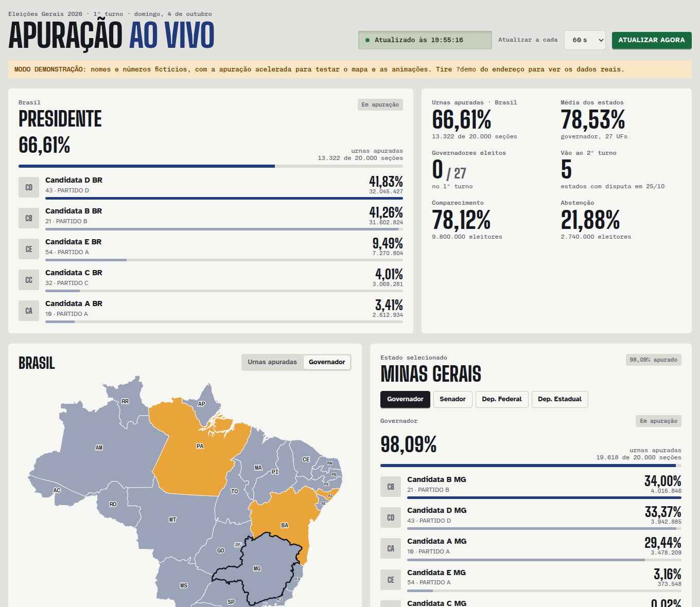

# Apuração 2026 ao vivo

**Acesse:** https://silenozlt.github.io/Eleicoes2026/

Painel para acompanhar a apuração do 1º turno das Eleições Gerais de 2026 (4 de outubro) direto no navegador, com os dados oficiais do TSE e atualização automática.

Prévia em modo demonstração, com nomes e números fictícios.

## O que dá para ver

- **Presidente:** ranking dos candidatos, urnas apuradas, comparecimento, abstenção, brancos e nulos.
- **Mapa do Brasil:** cada estado colorido pelo percentual de urnas apuradas, pelo candidato a presidente que lidera ali ou pela situação do governador (eleito, 2º turno ou em apuração).
- **Por estado:** lista dos 27 estados com quem lidera para presidente ou governador.
- **Escolha um estado** no mapa, na lista ou no seletor: abre presidente, governador, senador, deputados federais e estaduais (distritais no DF), com busca e contagem de eleitos por partido.
- **Consolidado:** lista dos eleitos já confirmados pelo TSE. Cada nova confirmação aparece com uma animação.

## Como usar

- Abra o link acima. A página se atualiza sozinha a cada 30 s, 60 s ou 2 min.
- Para ir direto a um estado, coloque a sigla no fim do endereço: [`#mg`](https://silenozlt.github.io/Eleicoes2026/#mg), [`#sp`](https://silenozlt.github.io/Eleicoes2026/#sp).
- Para testar com dados fictícios, use [`?demo`](https://silenozlt.github.io/Eleicoes2026/?demo).

## Como funciona

É um único arquivo `index.html`, sem servidor e sem dependências. O navegador lê os arquivos JSON públicos (os mesmos `dados/<uf>/<uf>-c<cargo>-e<eleição>-u.json` usados pelo site oficial) e as fotos dos candidatos de [resultados.tse.jus.br](https://resultados.tse.jus.br/oficial/app/index.html).

## Créditos

- Resultados: Tribunal Superior Eleitoral (TSE)
- Mapa: [@svg-maps/brazil](https://www.npmjs.com/package/@svg-maps/brazil) (CC BY 4.0)
